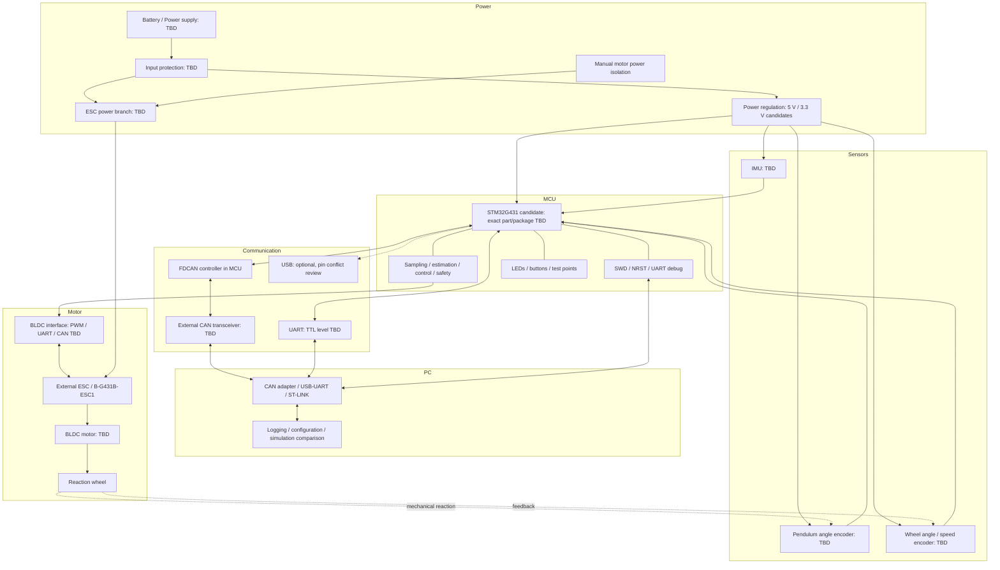

# Initial system architecture

概念設計。矢印は機能上の関係であり、電気的な配線・ピン番号・コネクタ指定ではない。

## Boundaries

- 自作controller案: Power input、input protection、5 V/3.3 V regulation、MCU、SWD、UART、CAN transceiver、IMU/encoder interface、ESC interface、LED/button/test points。
- 初期power stage: 外部ESC。controllerのロジック電源をmotor power配線に直結できるとは仮定しない。
- B-G431B-ESC1: 独自のMCUを持つ評価ボードであり、自作controller上のMCUと同一個体ではない。上位姿勢制御とESCのmotor controlの役割を分離するか、評価ボード単体で検証するかはTBD。
- PC: 設定とログ、model比較。PC切断時も安全状態へ移行できる構成を要求する。
- センサ: 異なる時刻の値を混ぜない。共通time baseと角度/回転方向の符号定義を作成する。

電源・GND・回生の検討は [power_tree.md](power_tree.md)、GPIO需要は [pinout.md](pinout.md) を参照。

## Task 2 implementation boundary

Concept above remains the whole-system target. Only the control-board branch is implemented: external regulated5 V → SS14 → AP2112K-3.3 → STM32G431RBT6, decoupling, NRST/BOOT, SWD/SWO, power LED and probe points. Sensors/CAN/UART/encoder/ESC/USB have no interface circuits yet. Their MCU pins are provisional reservations in pinout.md; motor supply/battery/regen remains TBD.
