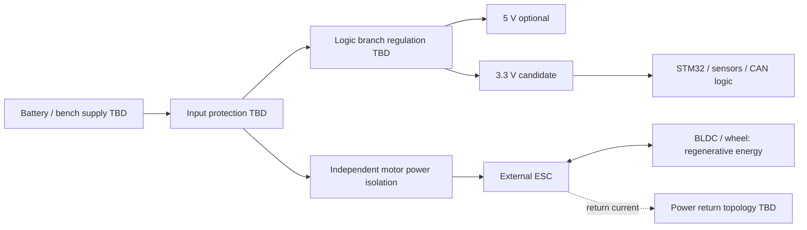

# Initial power tree

状態: ブロック案。部品・電圧範囲・定格・回路値はTBD。

| Domain | Candidate | TBD before circuit |
| --- | --- | --- |
| Input | Battery or current-limited bench supply | min/nom/max voltage、polarity、connector、peak current、fuse |
| ESC branch | External power stage | operating range、inrush、bulk capacitance、wire gauge、regen absorption |
| Logic supply | 3.3 V | MCU/sensor/transceiver budgets、ripple、startup、dropout、thermal loss |
| Auxiliary | 5 V if required | required loads、source、level shifting、backfeed prevention |
| Analog | filtered VDDA/reference concept | datasheet supply scheme、ADC accuracy、ground return |
| Debug/PC | VTref or adapter | USB/ESC/bench多重給電・GND loop・逆流・絶縁要否 |

減速時の回生energyは電源を過電圧にする可能性がある。電源が吸収できるとは仮定しない。motor power isolation時のESC残留energyと停止挙動も検討する。GND共通化または絶縁は選定したinterfaceに基づき決定する。
