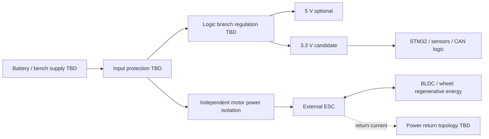

# Initial power tree

状態: ブロック案。部品・電圧範囲・定格・回路値はTBD。

| Domain | Candidate | TBD before circuit |
| --- | --- | --- |
| Input | Battery or current-limited bench supply | min/nom/max voltage、polarity、connector、peak current、fuse |
| ESC branch | External power stage | operating range、inrush、bulk capacitance、wire gauge、regen absorption |
| Logic supply | 3.3 V | MCU/sensor/transceiver budgets、ripple、startup、dropout、thermal loss |
| Auxiliary | 5 V if required | required loads、source、level shifting、backfeed prevention |
| Analog | filtered VDDA/reference concept | datasheet supply scheme、ADC accuracy、ground return |
| Debug/PC | VTref or adapter | USB/ESC/bench多重給電・GND loop・逆流・絶縁要否 |

減速時の回生energyは電源を過電圧にする可能性がある。電源が吸収できるとは仮定しない。motor power isolation時のESC残留energyと停止挙動も検討する。GND共通化または絶縁は選定したinterfaceに基づき決定する。

## Task 2 implemented control-board branch

上記は全systemの初期案。以下のみ実回路化した。ESC/battery/回生domainはTBDのまま。

| Ref | Value | Purpose / placement for future PCB |
| --- | --- | --- |
| C1 | 4.7 uF 10 V X7R | U2 VIN/GND local input, after D1; effective >=1 uF |
| C2 | 4.7 uF 10 V X7R | U2 VOUT/GND local output stability; effective >=1 uF |
| C3 | 100 nF | U1 VDD16/VSS15 local decoupling |
| C4 | 100 nF | U1 VDD32/VSS31 local decoupling |
| C5 | 100 nF | U1 VDD48/VSS47 local decoupling |
| C6 | 100 nF | U1 VDD64/VSS63 local decoupling |
| C7 | 4.7 uF | U1 VDD bulk near MCU |
| C8 | 100 nF | VBAT1 local supply decoupling, no separate battery |
| C9 / C10 | 10 nF / 1 uF | VDDA29 to VSSA27, DS12589 Figure 16 |
| C11 / C12 | 100 nF / 1 uF | VREF+28 to VSSA27, VREFBUF off |
| C13 | 100 nF | NRST7 to GND, AN5093 recommended external reset capacitor |

All capacitors are non-polarized ceramics. Analog/digital rail is electrically common; keep analog capacitor return paths local at VSSA and away from noisy currents. No PCB placement is performed yet. Practical load allocation: <=70 mA preliminary MCU allowance + <=1.6 mA LED + <=28.4 mA future reserve =100 mA. MCU allowance must be recalculated from actual clock/peripheral mode and datasheet current tables before firmware/high-speed operation. The 600 mA LDO rating is not a board power budget.

TP4 measures the common +3V3/VDDA/VREF rail. Probe pads and J2 do not provide isolation or reverse-current protection. Do not power from J2 VTref; use current-limited J1 supply. See design_notes.md for headroom/thermal calculations and unresolved surge/ESD/backfeed cases.
