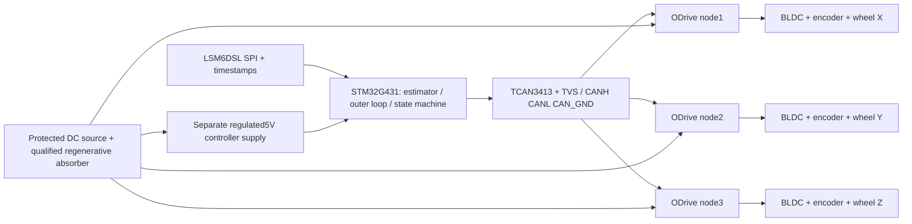

# Provisional three-axis architecture

A multidrop CAN bus needs one MCU peripheral/transceiver, not one per motor. Existing FDCAN1 PA11/PA12, TCAN3413DR, J3 pin1CANH/pin2CANL/pin3GND and selectable120ohm can serve3nodes architecturally; controller real-time firmware, oscillator accuracy, buffers, EMC and cable topology remain untested. Keep terminations at physical ends only. Daisy-chain H/L twisted pair; short stubs. Preserve CAN_GND as logic/common-mode reference; route phase/DC currents separately to source-negative. Micro CAN_GND is passthrough by default, not automatically DC-. Verify exact solder-jumper configuration; never send motor power through its1A passthrough. Review USB/DC ground loops separately.

Proposed Classic CAN1Mbps and500Hz torque commands per node,100Hz encoder reports,10Hzheartbeat andbus-voltage/current,1Hztemperature. Conservative stuffed-frame budget uses95bits DLC4 and135bits DLC8 including intermission: 19.1505% load.1kHzcommands give33.4005%. Rates exclude errors/retries and commissioning; establish timing/age limits with measurements.100Hzwheel feedback may be too stale for momentum feedback: if500Hzencoder reports are required, budget becomes35.3505% at500Hzcommands and49.6005% at1kHzcommands. CPU throughput/WCET not yet proven.

[CANSimple](https://docs.odriverobotics.com/v/latest/manual/can-protocol.html): unique node IDs1–3, Set_Input_Torque0x0e, encoder estimates0x09, heartbeat0x01, bus voltage/current0x17. Torque messages refresh watchdog; heartbeat alone does not. Explicit arming, stale-state and timeout checks; timeout coast/brake behavior needs a system safety decision.

[Micro](https://docs.odriverobotics.com/v/latest/hardware/micro-datasheet.html) supports CAN, internal magnetic encoder and compact packaging, but current/voltage/regen constraints must match selected motor. It has no built-in brake-resistor feature; [ODrive guidance](https://docs.odriverobotics.com/) requires a qualified battery or Regen Clamp solution.24V is a calculation assumption; battery, rail capacity/fusing, absorber energy and thermal duty are not selected. Micro vs higher-currentS1 decision follows motor selection, not nameplate peak power.

LSM6DSL supports the proposed state measurement architecture; sensor noise/ODR/filter latency and axis-to-body transform require validation. Six-axis IMU does not provide bounded absolute yaw; yaw-rate control or additional heading observation must be defined. Motor commutation encoders belong at each ODrive; old singleABI port is not3motorfeedback. Independent pendulum encoder remains useful on1axisfixture.

Legacy J6PWM/ENABLE/FAULT/UART circuitry retained unchanged as optional1axis asset. CAN replaces it for proposed ODrive torque control; no direct Micro compatibility claimed. No circuit/PCB edits this stage. Future copper changes must use45degree or arcs; prior90degree audit remains a release blocker.
