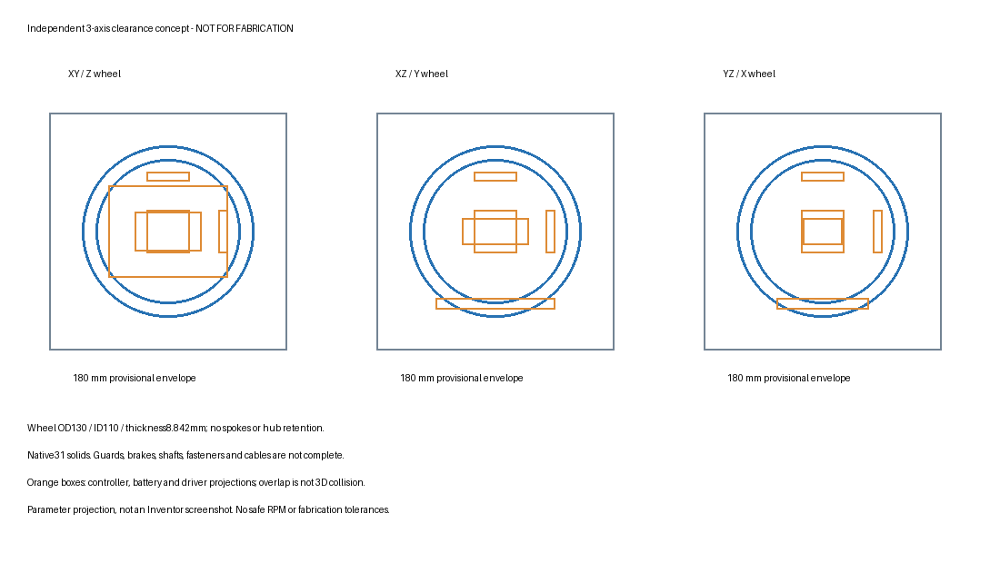

# Three-axis clearance concept — review only

Independent geometry, not a copy of the reference CAD; exact X machine not identified. Read [direction](../../docs/design_direction.md) and [mechanical limits](../../docs/mechanical_design.md) before using these files.

- `Cubli_clearance_concept.step`: original31solid native export, reimported into Inventor as31occurrences,180x180x180mm.
- `native_review.json`: native mass1.01046096kg, COM and inertia with assumed mass overrides, interference0 among modelled envelopes. Excludes180g reserve.
- `parameters.json`: independent geometry and analytical total with reserve1.19046096kg.
- `geometry_validation.json`: mass/COM/tensor cross-check; inertia discrepancy about1e-10kgm². STEP topology count is not full mechanical qualification.
- `step_reimport.json`: native reimport result; STEP does not preserve our assigned physical mass assumptions.
- `concept_review.svg` / `.png`: parameter projections, not native editor screenshots or fabrication drawings.
- `concept_bom.csv`: envelope inventory, not a purchase/production BOM.
- `screening_results.json`: fixed-pivot balance, analytical self-righting rejection and CAN budget.
- `build_inventor_concept.ps1`: native generator, tested with Inventor2025. New local `.ipt/.iam` are in ignored`local_native_v3/`; original1axis files were not opened or changed. Failed earlier local attempts are retained in ignored directories.

Native screenshot activation failed after successful save/export. Generator now omits GUI activation. Native shapes and STEP were validated, but no screenshot claim is made. No final STL/DXF or dimensioned manufacturing drawings: mounting/brake/wheel-retention and safe speed are blocked by motor performance/mounting information and contact/strength validation.

Reproduce screening: run `python simulation/cubli_screening.py` from repository root, then `python mechanical/cubli_concept/review_geometry.py` after generating a NEW native study. These scripts never edit original1axisCAD. Review generator refuses an existing native output directory. Dependencies: Python/numpy/Pillow; native generation uses Inventor2025 COM API. Report author and STEP metadata contain no local workstation paths; native files remain private locally.

