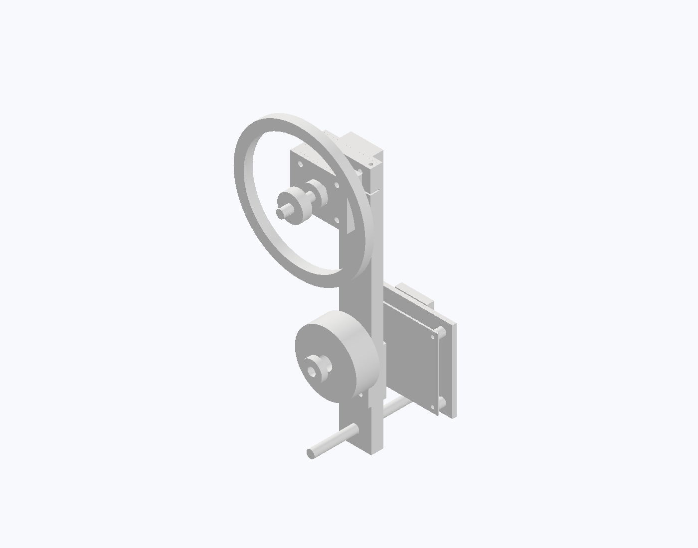

# M2 mechanical placement review — not a manufacturing release

Snapshot from local design commit 27380da (2026-10-07 publication).

This incremental public snapshot contains project-created Inventor review images and numerical reports. Native CAD stays local because its file metadata and unpublished ancestry contain private workstation paths. This public branch starts from the published electrical baseline b15af28; no local history was rewritten.

## Geometry and validation scope

Pivot-to-wheel center: 220 mm. Motor center Y70 mm; controller PCB center Y50 mm. PCB envelope 90 x 70 mm. Wheel reference annulus OD130 / ID110 mm, assumed aluminum mass 90 g. It has no spokes or validated hub attachment.

The native placement study has 24 grounded occurrences and zero modeled pair interferences. It is not a constrained moving mechanism. Native mass 559.814 g uses assumed mass overrides; adding a hypothetical 30 g reserve gives 589.814 g, leaving only 0.186 g against a 590 g budget. This reserve is insufficient to establish manufacturability. Conditional model screening passed 17 cases; no real motor, strength, thermal, encoder or rotating test validation is implied.

## Motor data decision

GB54-1 KV33 remains a candidate, not a frozen selection. The manufacturer catalogue does not establish mounting-face identity, thread depth or safe screw insertion, torque-speed curves or thermal test conditions. Inspecting a purchased sample can establish dimensions, but cannot replace rated performance evidence. Purchase is not authorized or performed by this publication.

Manufacturer source: https://www.ligpower.com/product/ligpower-gb54-1-gimbal-type.html

No matching GB54-1 GrabCAD model was confirmed in targeted public searches on 2026-10-07. This does not establish that none exists. Public download availability is not an open-source license. No third-party CAD or datasheet has been redistributed.

## Remaining work

- Obtain manufacturer mounting and performance information, or select a better documented motor.
- Finish motor adapter, wheel retention/spokes, encoder, belt, frame, guard, fasteners and cable paths.
- Establish printed-part strength, balance and a safe physical speed limit.
- Reduce mass with a meaningful reserve; verify assembly motion and service access.
- Export a neutral CAD model and verify its reimport. STEP export was not completed: Inventor active-object access was unavailable in two attempts. Images and reports are the only CAD review outputs in this increment.

